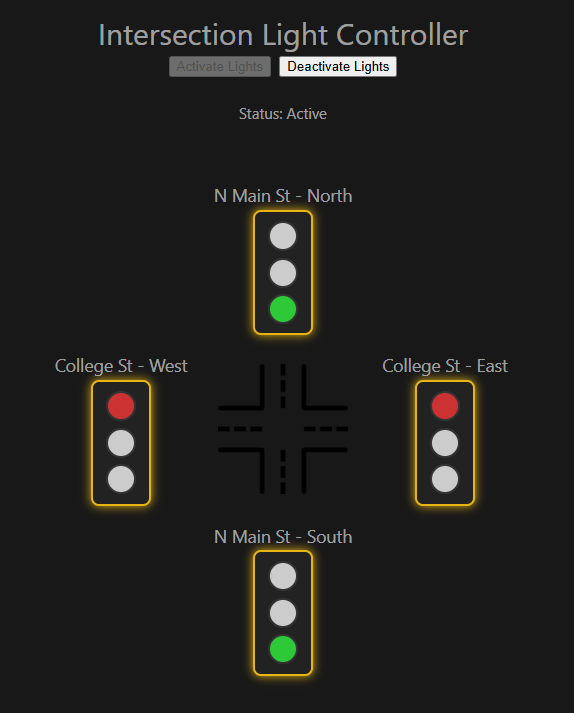

# Traffic Light Controller - Patrick Woodrum

This application will function as a traffic controller visual with minimal aesthetics. It will consist of an intersection, four traffic lights, and the logic to make them function as they should in the real world with added buttons for total control. 

This project will be used to showcase my abilities with both backend and frontend coding, using Java and Vue respectively.

Six scenarios have been provided alongside a background descriptor. I will be completing as many as possible while adding my own personal touch. I intend to make this a work I will be proud of, as I strive to do with every project.

Upon completion or submission the following questions will be answered:

1. How would you evaluate your work? What went well? What would you do differently?
2. What was an insight you gained or something you learned while working on this?
3. If you were to add another test challenge to this, what would it be? Why?
